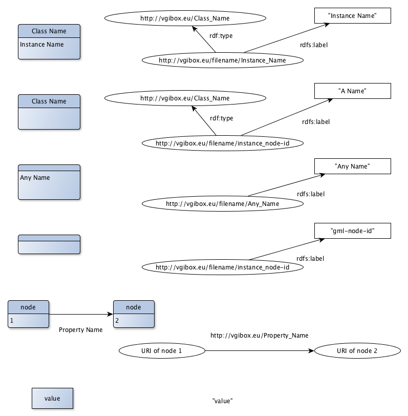

# graphml2rdf
Use yEd/graphml graphs to produce RDF graphs

This xsl stylesheets transforms a graphml file produced by yEd using the Entity-Relationship elements into an RDF graph.

### Preparing the graph

The graph must be composed of 'Entity with Attributes' nodes (from the Entity-Relationship palette in yEd)

  - the Entity field (top) must contain a class name (or empty)
  - the Attributes field (bottom) must contain an instance name (or empty)
  
### Running the transformation tool

Download the Saxon xml library (saxon9he.jar from ...)

   $ java -jar saxon9he.jar -xsl:graphml2rdf.xsl graphmlfile  >RDFfile
   
### Transformation principles

 

The instance names generate "local" URIs, based on the input file name.  Thus several generated RDF files can be uploaded in an endpoint without mixing up the instance names. The class names generate "global" URIs, so all class names refer to the same set of classes, independent of the source file.
